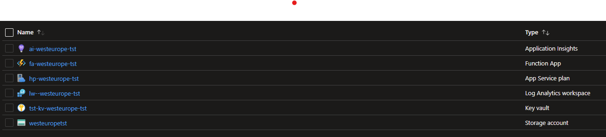

# Bicep example with default Azure Function setup

Fucntion, Storage, Key Vault, Log Analytics workspace,
Application Insights

## How to use

1. Install Azure CLI and opent folder with this repo.
2. Create group `az group create --location westeurope --name test-group`
3. Deploy bicep `az deployment group create --resource-group test-group --template-file infrastructure.bicep --parameters sku=F1 apiKey=superSecret`

## Result

